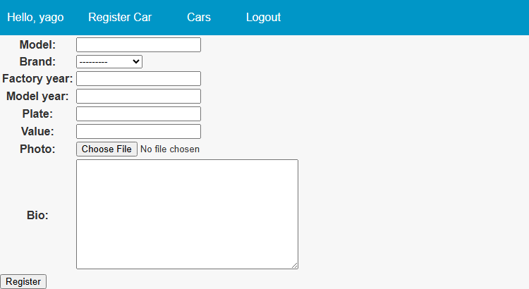
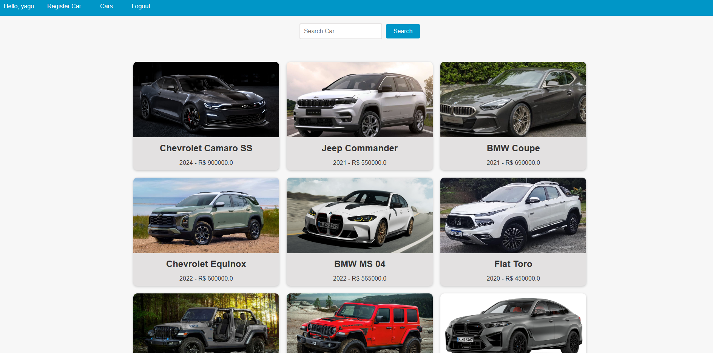
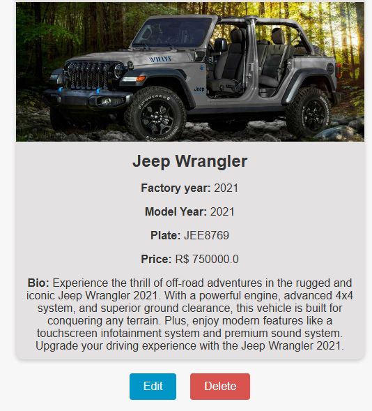

# 🚗 Carros

A Django project for managing and exploring car data, with AI integration for advanced experiences!  
Built with best practices, extensibility, and production readiness in mind.

---

## 📋 Overview

**Carros** is a web application built with Django that allows users to register, view, and interact with car data. The system features authentication, user management, full CRUD functionality for vehicles, and smart features powered by the OpenAI API.

The project architecture is modular, separating user, vehicle, and AI logic into dedicated Django apps—making maintenance and feature evolution easy.

---

## 🚀 Features

- User registration, login, and profile management
- Full CRUD (Create, Read, Update, Delete) for cars
- Integration with OpenAI/ChatGPT for a virtual assistant and smart features
- Responsive web interface using Django templates
- Production-ready configuration (uWSGI, PostgreSQL)
- RESTful structure, following Django best practices
- Easily customizable for new features

---

## 📸 Screenshots

### Vehicle List


### Register New Car


### Car Details



---

## 🛠️ Technologies

- **Backend:** [Django 4.1.6](https://www.djangoproject.com/)
- **Database:** PostgreSQL (via `psycopg2-binary`)
- **AI Integration:** OpenAI API
- **Deployment/Server:** uWSGI
- **Package Management:** pip
- **Requirements:** See [`requirements.txt`](requirements.txt)

---

## 🏗️ Project Structure

```
carros/
├── accounts/              # User app (authentication, profiles)
│   ├── admin.py
│   ├── apps.py
│   ├── migrations/
│   ├── models.py
│   ├── tests.py
│   └── views.py
│
├── app/                   # Django settings, URLs, WSGI/ASGI
│   ├── asgi.py
│   ├── settings.py
│   ├── urls.py
│   ├── wsgi.py
│   └── templates/
│
├── cars/                  # Vehicle logic (models, views, forms)
│   ├── admin.py
│   ├── apps.py
│   ├── migrations/
│   ├── models.py
│   ├── tests.py
│   └── views.py
│
├── openai_api/            # AI/ChatGPT features
│   ├── client.py
│   └── ...
│
├── docs/                  # Screenshots and documentation (add your images here!)
│   ├── screenshot1.png
│   ├── screenshot2.png
│   └── ...
│
├── manage.py
├── requirements.txt
├── carros_uwsgi.ini       # uWSGI configuration for production
├── uwsgi_params           # uWSGI params
└── README.md
```

---

## ⚡ Getting Started

### Prerequisites

- Python 3.8+
- PostgreSQL
- Virtualenv (recommended)

### Installation

```bash
# Clone the repository
git clone https://github.com/yagosamu/cars_django.git
cd carros

# Create and activate a virtual environment
python -m venv venv
source venv/bin/activate

# Install dependencies
pip install -r requirements.txt
```

### Database Setup

1. Create a PostgreSQL database and user for the project.
2. Update `app/settings.py` with your database credentials.

```bash
# Example using psql
createdb carros_db
createuser carros_user --pwprompt
# Grant necessary permissions
```

### Run Migrations

```bash
python manage.py migrate
```

### Create a Superuser (optional)

```bash
python manage.py createsuperuser
```

### Run the Development Server

```bash
python manage.py runserver
```

---

## 🤖 OpenAI Integration

The `openai_api` app provides smart features using the OpenAI API.

- Add your OpenAI API key to your environment or configuration file.
- See OpenAI’s documentation: https://platform.openai.com/account/api-keys
- The `openai_api/client.py` file manages API communication.

---

## 🧑‍💻 Contributing

Contributions are welcome!  
For major changes, please open an issue to discuss what you want to change.

1. Fork the project
2. Create a branch: `git checkout -b my-feature`
3. Commit your changes: `git commit -m 'feat: new feature'`
4. Push to your fork: `git push origin my-feature`
5. Open a Pull Request

